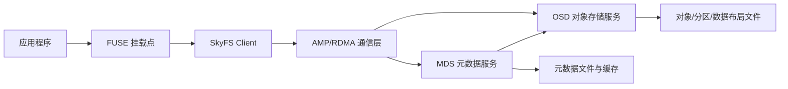

# SkyFS 架构与代码阅读说明

本文档基于当前仓库源码整理，目标是帮助读者快速建立 SkyFS 的模块边界、请求路径和关键数据结构认知。文档只描述现有代码，不改变实现语义。

## 1. 总体架构

SkyFS 由三类运行进程和一个公共通信层组成：

- `client/` 将 POSIX 文件操作映射为 MDS/OSD 请求，并维护客户端缓存、预取、压缩线程和 GPU 压缩状态。
- `mds/` 管理 inode、目录项、目录子集、元数据缓存、锁和元数据布局。
- `osd/` 管理对象数据、数据布局、对象分区、复制、恢复、xattr 和压缩块。
- `amp-rdma/` 提供异步消息传递、连接管理、请求发送、线程和协议封装。
- `include/` 定义跨模块共享的常量、类型、文件系统结构和消息协议。

## 2. 启动流程

### Client

入口文件是 `client/client.c`。主流程为：

1. 从命令行最后一个参数读取 `client_this_id`。
2. 调用 `__skyfs_daemonize` 进入后台模式。
3. 读取变量配置和集群拓扑。
4. 初始化 AMP 通信上下文并连接 MDS/OSD。
5. 创建客户端工作线程。
6. 初始化布局、客户端缓存和 GPU 压缩相关缓冲。
7. 调用 `init_compress_worker_threads`。
8. 进入 `fuse_main(argc - 1, argv, &skyfs_oper, NULL)`。

FUSE 操作表定义在 `client/client_op.c` 的 `skyfs_oper`，覆盖 `statfs`、`open`、`create`、`unlink`、`rename`、`mkdir`、`getattr`、`readdir`、`truncate`、`read`、`write`、`getxattr`、`setxattr`、`flock`、`lock`、`destroy` 等操作。

### MDS

入口文件是 `mds/mds.c`。主流程为：

1. `__skyfs_MS_parse_parameter` 解析启动参数。
2. `__skyfs_MS_get_conf` 读取配置。
3. `__skyfs_MS_init_com` 初始化通信。
4. `__skyfs_MS_create_threads` 创建服务线程、简单请求线程、状态线程、写回线程和负载均衡线程。
5. `__skyfs_MS_init_fs` 初始化文件系统元数据、布局和根目录。
6. `__skyfs_MS_init_log` 初始化日志。
7. `__skyfs_MS_init_signal` 注册信号处理。
8. 主线程等待 `skyfs_MS_finailize_sem`。

### OSD

入口文件是 `osd/osd.c`。主流程为：

1. `__skyfs_SS_parse_parameter` 解析 OSD 参数。
2. `__skyfs_SS_create_threads` 创建服务线程、转发线程、简单请求线程、状态/缓存监控线程、文件缓冲释放线程和负载收集线程。
3. `__skyfs_SS_get_conf` 读取配置。
4. `__skyfs_SS_init_com` 初始化通信。
5. `__skyfs_SS_init_signal` 注册信号处理。
6. `__skyfs_SS_init_osd` 初始化对象存储和数据布局。
7. 主线程等待 `skyfs_SS_finailize_sem`。

## 3. 消息协议

SkyFS RPC 协议集中在 `include/skyfs_msg.h`。

- `enum skyfs_msg_types` 定义消息编号。
- `skyfs_msg_t` 是请求/响应的统一消息体。
- `SKYFS_INIT_MSG` 和 `SKYFS_FILL_REQ` 用于在 AMP 请求中填充 SkyFS 消息头和请求元数据。
- MDS 消息覆盖 `STATFS`、`LOOKUP`、`CREATE`、`REMOVE`、`READ_INODE`、`WRITE_INODE`、`READDIR`、`RENAME`、`FLOCK`、`GET_LAYOUT`、负载均衡等。
- OSD 消息覆盖 `READ_OBJ`、`WRITE_OBJ`、`CREATE_OBJ`、`REMOVE_OBJ`、`READ_BMETA`、`WRITE_BMETA`、`READ_SUBSET`、`WRITE_SUBSET`、复制恢复、xattr、多对象读写等。

对象 I/O 的核心请求向量是 `skyfs_io_vector_t`，包含 inode、对象 ID、对象大小、对象内偏移、长度、压缩算法、复制数、复制 ID、分区 ID、直连/转发标记等字段。

## 4. Client 调用链

客户端的主要代码分层如下：

- `client_op.c`：FUSE 回调实现，负责路径解析、权限/属性操作、读写入口和 xattr。
- `client_itm.c`：Client to MDS 请求封装，例如 lookup、create、remove、readdir、rename、readlink。
- `client_ito.c`：Client to OSD 请求封装，例如 read object、write object、xattr 和压缩/解压处理。
- `client_cache.c`：目录项、inode、文件缓冲等客户端缓存。
- `client_thread.c`：客户端异步线程。
- `client_compress_thread.c`、`util_compress.c`、`gpu_compress_file.c`：压缩、GPU 压缩和数据处理路径。

典型读流程：

1. FUSE 调用 `skyfs_read`。
2. 客户端根据路径解析 inode 和元数据。
3. 按对象大小和偏移拆分读请求。
4. `client_ito.c` 组装 `SKYFS_MSG_O_READ_OBJ`。
5. AMP 将请求发送到目标 OSD。
6. OSD 返回数据和压缩/布局信息。
7. 客户端按算法字段决定是否解压并填充用户缓冲区。

典型写流程：

1. FUSE 调用 `skyfs_write`。
2. 客户端计算对象 ID、对象内偏移和写入长度。
3. 根据 xattr/算法字段选择是否压缩。
4. 组装 `SKYFS_MSG_O_WRITE_OBJ` 或多对象写请求。
5. OSD 写入对象分区并返回空间变化、布局位置等信息。
6. 客户端必要时更新 MDS 元数据，例如大小、时间戳和空间统计。

## 5. MDS 元数据管理

MDS 的主要职责是维护文件系统元数据和目录结构。

- `mds_op.c`：处理 MDS 对外 RPC，如 lookup、create、remove、rename、readdir、flock、get layout。
- `mds_cache.c`：维护目录缓存、子集缓存、bmeta/mmeta 缓存、写回和目录深度管理。
- `mds_meta.c`：元数据分配、ino 管理和持久化辅助。
- `mds_layout.c`：MDS 布局版本、哈希映射和布局写回。
- `mds_loadb.c`：负载均衡触发和执行。
- `mds_flock.c`：POSIX lock/flock 相关处理。
- `mds_thread.c`：按消息类型将请求分发给处理函数。

元数据结构定义在 `include/skyfs_fs.h`，其中 `skyfs_meta_t` 表示通用 inode 属性，`skyfs_M_cmeta_t` 表示 MDS 缓存中的扩展元数据，包含名称、hash key、空间占用、深度和扩展属性。

## 6. OSD 数据管理

OSD 管理对象数据、数据布局和复制。

- `osd_dop.c`：对象读写、删除、xattr、多对象写、复制写、恢复写和提交写。
- `osd_dl.c`：数据布局子集、chunk、partition、replica location 等管理。
- `osd_cache.c`：对象缓冲缓存。
- `osd_loadb.c`：OSD 负载状态收集和读副本选择。
- `osd_replica.c`：副本放置策略。
- `osd_rw.c`、`osd_mop.c`、`osd_meta.c`：对象文件、元数据和辅助操作。
- `osd_thread.c`：请求队列、服务线程和消息分发。

对象大小、分区粒度和复制相关常量在 `include/skyfs_const.h` 中定义。当前默认对象大小为 `SKYFS_OBJECT_SIZE`，对象按 `SKYFS_MAX_OBJ_PER_PART` 划分分区，默认复制数为 `SKYFS_DEFAULT_REPLICA_NUM`，最大复制数为 `SKYFS_MAX_REPLICA_NUM`。

## 7. 数据布局、复制与恢复

SkyFS 同时维护元数据布局和对象数据布局。

- MDS 侧使用目录 hash、子集、bmeta 和布局版本来决定元数据归属。
- OSD 侧使用 data layout subset、chunk、partition 和 replica location 来决定数据对象归属。
- 请求如果到达非目标 OSD，OSD 会根据布局信息转发请求。
- 复制恢复消息包括 `SKYFS_MSG_O_RECOVER_REPLICA`、`SKYFS_MSG_O_QUERY_REPLICA`、`SKYFS_MSG_O_ASK_RECOVER_REPLICA`。
- 写路径中存在 prepare/commit/remote replica write/recover replica write 等函数，用于复制和恢复场景。

这部分逻辑主要分布在 `osd/osd_dop.c`、`osd/osd_dl.c`、`osd/osd_replica.c` 和 `include/skyfs_msg.h`。

## 8. 压缩与 xattr

压缩算法常量定义在 `include/skyfs_fs.h`，包括 none、zstd、zlib、ADM、PANS、MANS、SZ2、SZ3 和 GPU zstd 等标记。

客户端通过 xattr 和元数据中的算法字段驱动压缩行为。`client/client_op.c` 中列出了示例 xattr 名称，例如 `user.compression_type`、`user.compression_vector`、`user.encription_type`、`user.test_write`。实际对象读写时，`client/client_ito.c` 会根据算法字段决定压缩或解压路径。

OSD 侧负责按对象、分区和压缩区间维护实际数据写入。相关代码集中在 `osd/osd_dop.c`、`osd/util_compress.c`、`osd/MANS/` 和 `osd/SZ3C/`。

## 9. 构建与环境注意事项

当前源码保留原始 HPC 集群构建习惯：

- Makefile 会把产物复制到 `/cluster/skyfs/bin`。
- 配置、元数据、对象和数据布局默认路径也位于 `/cluster/skyfs` 下。
- 客户端 Makefile 默认引用 `client/fuse-2.9.4`，该目录未必随仓库完整提供。
- RDMA 构建依赖 `libibverbs` 和 `librdmacm`。
- 压缩路径依赖 zstd、zlib、OpenMP、PANS/MANS、SZ3C、CUDA/nvcomp 等库。

因此在新机器上首次构建时，应先补齐第三方依赖和集群路径，再按 `amp-rdma/source/userspace`、`mds`、`osd`、`client` 的顺序构建。

## 10. 推荐阅读顺序

1. `include/skyfs_const.h`：容量、路径、端口、角色和对象大小等基础常量。
2. `include/skyfs_fs.h`：文件系统元数据、拓扑和压缩算法结构。
3. `include/skyfs_msg.h`：所有 RPC 消息类型和请求/响应结构。
4. `client/client.c` 与 `client/client_op.c`：客户端启动和 FUSE 操作表。
5. `mds/mds.c`、`mds/mds_thread.c`、`mds/mds_op.c`：MDS 启动、分发和元数据操作。
6. `osd/osd.c`、`osd/osd_thread.c`、`osd/osd_dop.c`：OSD 启动、分发和对象读写。
7. `amp-rdma/source/userspace/`：通信库、连接、请求和线程实现。
